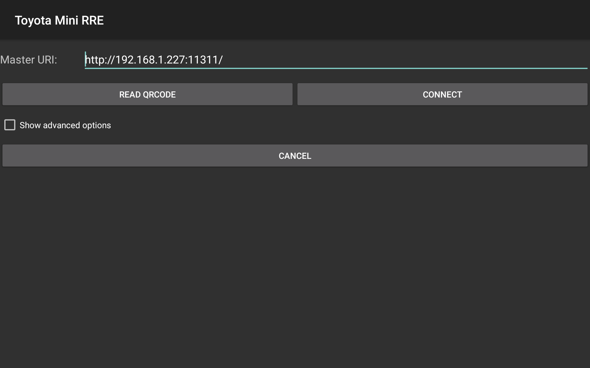

.. _gui:
Tutorial: Android Application
=============================

The Android application Toyota Mini RRE allows a user to operate MiniReach without use of a connected computer. The grapical user interface shows the user MiniReaches position in map and sensor information such as base laser scans and camera view. The user can also directly control MiniReach either by manual control or sending tasks to be completed.

Installation 
------------
The application is installed via the software `AndroidStudio <https://developer.android.com/studio/index.html>`_ which also is the recommended development platform. The git repository minireach_android accessed through Toyota Material Handling needs to be opened in AndroidStudio. In order to transfer the application over to desired unit, follow the instructions from the AndroidStudio developers found `here <https://developer.android.com/studio/run/device.html>`_.

Requirements
~~~~~~~~~~~~
Platforms with operating system Android of version 4.0.4 (API 15) or greater is required for
running the application.

The application is designed for tablets with screen size 8" or greater. The functionality
remains the same for smaller screens, however the graphical user interface could look distorted.

Running the Application
-----------------------
In order for the application to function MiniReach needs to be connected to the same WiFi network as the unit running the application. MiniReach needs to be turned on and running a ROS master inorder for the application to function.

Connect to Minireach
~~~~~~~~~~~~~~~~~~~~

When starting the application it needs to connect to the ROS master which is done by the interface shown above. The user needs to enter the IP and PORT of the platform running the ROS master typically run on MiniReach.

.. note::

   The default IP and PORT values of MiniReach is:
    - IP: 192.168.1.34 (local)
    - PORT: 11311 (ROS default)

When connecting the application will display a message if connection is successful and manual control mode will be started. If IP and PORT is entered in wrong format the application can crash and will in that case restart.

Manual Control
~~~~~~~~~~~~~~~~~~~~

====== ========================================================
View # Function (details below)
====== ========================================================
1      Primary view    
2      Settings
3      Secondary view
4      Joystick
5      Fork control
====== ========================================================

During manual control the graphical user interface shown above will be shown. Showing map and camera views are both taxing on the platform hardware so these are disabled by default. They can be enabled under Settings.

The secondary view, in the example above showing the map, can be swaped with the primary by clicking on the secondary view. If map is in the primary view it can be manipulated by rotation and translation by use of the same gestures as other common Android applications.

The basic 2D motion of MiniReach can be controlled by use of the joystick. Controlling the fork height and reach as well as camera angle can be controlled stepwise by fork control.

Autonomous control mode can be entered by the android button.

Autonomous Control
~~~~~~~~~~~~~~~~~~~~

Similarly to manual control the graphical user interface used in autonomous control as shown above contains a primary and a secondary view where map and camera views can be displayed. The same functionality as in manual control mode is given for these views.

MiniReach can be controlled by two separate methods. Holding a point on the map will let the user send a command to MiniReach to move to the marked point. More extensive tasks can be controlled by the controlpanel to the right. The available commands can be selected at the top, those with additional parameters required will be shown in the controlpanel. As can be seen above move pallet require the user to select which pallet to move where. The commands are not sent to MiniReach until execute is pressed.

============ ========================================================
Command      Function (details below)
============ ========================================================
Move pallet  Move a stored pallet to a stored pallet location.
             (Not yet implemented) 
Mapping      Start mapping on minireach which is controlled manually.
             (Not yet implemented) 
============ ========================================================

