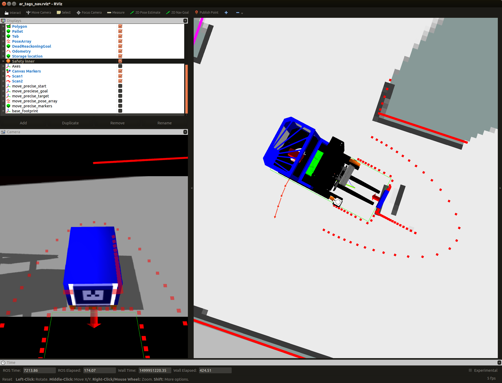
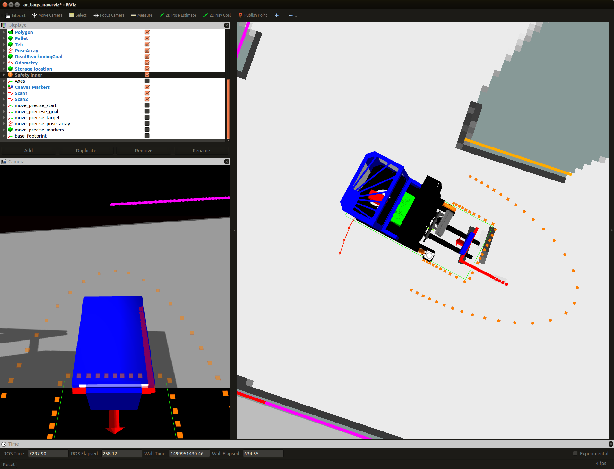

API Overview
============

One of the ways in which we have tried to create a good experience for
new developers is by using standard ROS interfaces. This means that code you
might have written for other robots in the past should be easily portable
to your new robot.

Whenever possible, we have conformed to the
`ROS Enhancement Proposals (REPs) <http://www.ros.org/reps/rep-0000.html>`_.
These documents provide the foundation of standard ROS interfaces.

Fork and Reach
--------------

The fork and reach of the robot are controlled by an interface defined in
`robot_mechanism_controllers/JointPositionController <http://wiki.ros.org/robot_mechanism_controllers/JointPositionController>`_

Publishing a float to the /minireach/fork_position_controller/command topic will make the controller try to move the linear motor that controls the fork to an extension defined by the float in meters. For the moment, 
height 0.0 is calibrated to mean that the underside of the forks are touching the ground and can not go any lower. The top of the forks will end up at about 1 cm (thickness of the forks) above the published height because of this.

The reach joint can be controlled in a similar manner by publishing to /minireach/reach_position_controller/command.

Only one controller is allowed to control a joint at a time.

.. _base_api:

Base Interface
--------------
Support for mobile bases is quite standard and robust in ROS, however it is one
of the older interfaces. As such, it is one of the few interfaces which is not
action-based.

The mobile base subscribes to `base_controller/command`, and accepts a
`geometry_msgs/Twist <http://docs.ros.org/api/geometry_msgs/html/msg/Twist.html>`_
message.

Only two fields are used in the message:

 * ``linear.x`` specifies the robot's forward velocity
 * ``angular.z`` specifies the robot's turning velocity

User applications will typically not connect directly to `base_controller/command`,
but rather to `cmd_vel` or `nav_vel`. A multiplexer is always running between `teleop_vel`
and `cmd_vel` and a few other topics. Whenever the deadman on the robot controller is held, `teleop_vel`
will override `cmd_vel`. The advantage of having your application publish to `nav_vel`
rather than directly to `base_controller/command` is that you can override bad
commands by simply pressing the deadman on the robot controller.

The truck has support for speed reduction when in the proximity of
obstacles. When this system is active, the truck will not be able to drive into
obstacles that are detected by the laser scanners. Is will also limit the maximum allowed speed close to
obstacles.
This prevents the truck from picking upp pallets, so it has to be deactivated
during pallet handling.

The visualization of the safety fields turns red when some obstacle (red arrow)
is in the stop field (red rectangle). This completly stops the truck from moving
in that direction.

This terminal command diables safety as long as it is running: ::

  rostopic pub -r 10 /disable_safety std_msgs/String "data: ''"

.. _head_api:

3D Camera Tilt Interface
------------------------

The 3D camera in the fork facing direction on the robot is controlled by an
interface defined in `robot_mechanism_controllers/JointPositionController <http://wiki.ros.org/robot_mechanism_controllers/JointPositionController>`_

Publishing a float to the /minireach/camera_tilt_controller/command topic will make the controller try to move the camera tilt axis to the angle defined by the value of that float in radians.

::

  rostopic pub /camera_tilt_controller/command std_msgs/Float6"data: 0.8"

.. _camera_api:

3D Camera Interface
-------------------

We have been avaluating two different 3D cameras for the MiniReach, the ZED stereo camera and the structured light based (kinect like) Orbbec Astra.

The following infromation is for the Orbbec Astra.

The fork facing camera exposes several topics of interest:

 * `camera/depth_registered/points` is a `sensor_msgs/PointCloud2 <http://docs.ros.org/api/sensor_msgs/html/msg/PointCloud2.html>`_
   which has both 3d and color data. It is published at VGA resolution (640x480)
   at 30Hz.
 * `camera/rgb/image_raw` is a `sensor_msgs/Image <http://docs.ros.org/api/sensor_msgs/html/msg/Image.html>`_.
   This is just the 2d unrectified color data. It is published at VGA resolution (640x480)
 * `camera/rgb/image_rect_color` is a `sensor_msgs/Image <http://docs.ros.org/api/sensor_msgs/html/msg/Image.html>`_.  This is the rectified 2d color data. In simulation this topic is a slightly delayed copy of `camera/rgb/image_raw`.  On the real truck this
   It is published at VGA resolution (640x480)
   at 3330Hz.

.. _laser_api:

Laser Interface
---------------

`scan1` is a `sensor_msgs/LaserScan <http://docs.ros.org/api/sensor_msgs/html/msg/LaserScan.html>`_ from the fork laser.
`scan2` is a `sensor_msgs/LaserScan <http://docs.ros.org/api/sensor_msgs/html/msg/LaserScan.html>`_ from the drive_wheel laser.
`scan` is a merged version of `scan1` and `scan2` on the `base footprint` frame. (used by SLAM algoritm)
