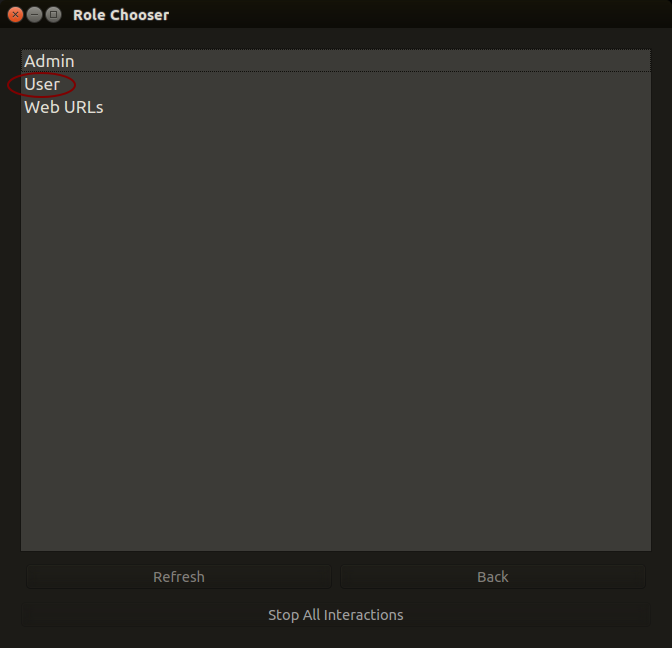
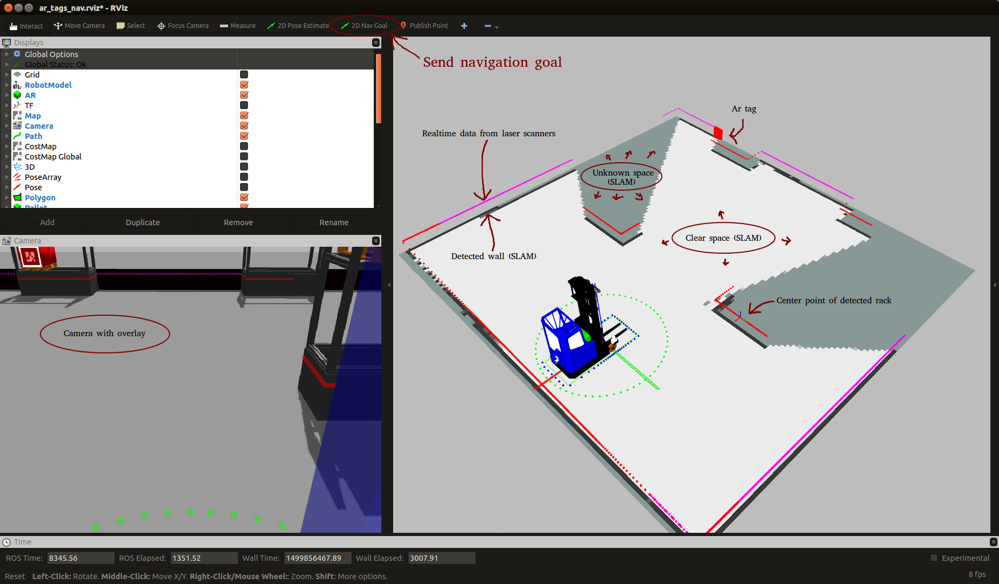

Tutorial: Demo
====================

The goal of this tutorial is to make the simulated truck move pallets between
storage locations in diffrent racks.

We first start the system in "monosim" mode by running the terminal command

::

  roslaunch minireach_gazebo monosim.launch

.. figure:: _static/start.png
   :width: 100%
   :align: center
   :figclass: align-centered

If everything is correctly installed two new windows should now open, Gazebo
client and rocon_remcon.

.. figure:: _static/gazebo.png
   :width: 100%
   :align: center
   :figclass: align-centered

Using rocon_remocon
-------------------
.. figure:: _static/remocon_add.png
   :width: 100%
   :align: center
   :figclass: align-centered

`Qt remocon <http://wiki.ros.org/rocon_app_manager/Tutorials/indigo/Run%20Interactions%20with%20QT%20Remocon/>`_
is part of the `Robotics In Concert <http://wiki.ros.org/rocon/indigo/Guide>`_ framework, often refered to as `rocon`.
This is a simple graphical interface that allows you to interact with compatible robots/trucks.

If you have a clean install, the `Ros Master List` will be empty.
To add a new `Ros Master` press the `Add` button.

.. figure:: _static/remocon_add.png
   :width: 100%
   :align: center
   :figclass: align-centered

`Ros Master List` should now have an entry with your trucks name, default name is `robot`.
Doubleclick this entry to continue.

.. note:: Sometimes a part of the interface system does not start property. You will then get the
 error message seen below. This should go away if you restart `monosim` but you may
 sometimes need to log out from your linux user and log back in again to make it
 work.

Doubleclick `User` to see available `Robot Apps <http://wiki.ros.org/rocon/indigo/Guide#rocon_app_platform.Rapps>`_
or `rapps`.

In this demo we will use the `Handle Pallet` rapp, so dobleclick on that to start it.

.. figure:: _static/remocon_handle_pallet.png
   :width: 100%
   :align: center
   :figclass: align-centered

The rapp interface in the image below should pop up on your screen after a while.

.. figure:: _static/remocon_app_pairing.png
   :width: 100%
   :align: center
   :figclass: align-centered

We could start using the rapp to move pallets now, but to get a better idea about what is going on we sould start
a vizualisation tool first. Click `Back` to return to the `Role Chooser`.

.. figure:: _static/remocon_handle_pallet_back.png
   :width: 100%
   :align: center
   :figclass: align-centered

This time Select `Admin` in staid of `User` in the interface.

This will give us access to "start buttons" for several vizualisation tools. The
one will want to start now is called `rviz <http://wiki.ros.org/rviz>`_
This tool displays sensor data and what the truck "knows" about its environment.

You can now move the truck by sending waypoints or a so called `Navigation Goal`
by pressing the button in rviz the on the position in the map where you want the
truck to go.

See the tutorial on using RVIZ with navigation in the RVIZ
`documentation <http://wiki.ros.org/navigation/Tutorials/Using%20rviz%20with%20the%20Navigation%20Stack>`_.

In order to tell the truck to move pallets between racks we need to assign IDs
to them. We can add a rack with an ID by:
 * Driving up to a rack.
 * Pointing the forks towards the rack until a marker appears in the front center of it.
 * Entering a number into the `Rack ID` field and clicking `Update Rack Pose`.

Pallets with AR-tags (detected by the camera) are automaticly added (with IDs
based on the ID of the tag) if they are close enough to a storage location
in a rack.

.. figure:: _static/rviz_rack_added.png
   :width: 100%
   :align: center
   :figclass: align-centered

At this point we could start moving the already detected pallet to other storage
locations in the same rack, but let's add some more racks before we do anything else.

To start moving pallets do the following:
 * Enter a `Pallet ID` in the interface.
 * Enter a `Storage ID` in the interface.
 * Click the `Send Mission` button.

.. figure:: _static/mission/mission3.png
   :width: 100%
   :align: center
   :figclass: align-centered

.. figure:: _static/mission/mission4.png
   :width: 100%
   :align: center
   :figclass: align-centered

.. figure:: _static/mission/mission12.png
   :width: 100%
   :align: center
   :figclass: align-centered

Moving an empty pallet (no AR-marker)
-------------------------------------

If there are no empty pallets in the simulation environment, you need to add one.

.. figure:: _static/gazebo_no_pallet.png
   :width: 100%
   :align: center
   :figclass: align-centered

You can to this by selecting `pall` under the `Insert` tab and using the move
tool to place it into the rack.

.. figure:: _static/gazebo_pallet.png
   :width: 100%
   :align: center
   :figclass: align-centered

You also need to give the pallet an ID and tell the truck where it is in order
to be able to interact with it. At the time of writing this tutorial, there is
no way to do this using a graphical interface. (This may have added when you
read this...)

.. figure:: _static/rviz_add_empty_pallet.png
   :width: 100%
   :align: center
   :figclass: align-centered

For now you can use the following terminal command to add an empty pallet with ID 9 
to storage location 1c.

.. figure:: _static/terminal_add_pallet.png
   :width: 100%
   :align: center
   :figclass: align-centered

.. figure:: _static/rviz_pallet_added.png
   :width: 100%
   :align: center
   :figclass: align-centered

You can use the grapical interface to send a mission in the same way you did
before. The truck will use the camera and `VISP <https://visp.inria.fr/>`_ to
try to match a 3d model to a pallet in the specified storage location and start
tracking it.

.. figure:: _static/tracking_init.png
   :width: 100%
   :align: center
   :figclass: align-centered

.. figure:: _static/tracking.png
   :width: 100%
   :align: center
   :figclass: align-centered

.. figure:: _static/gazebo_pick_empty.png
   :width: 100%
   :align: center
   :figclass: align-centered

