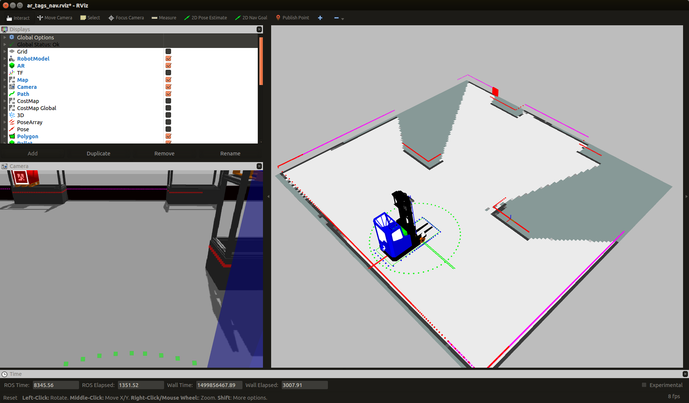

.. _document_instruction:
Instruction to write document
=============================

To be able to compile and make the document file you need to run:

::

    >$ sudo apt-get install python-sphinx
    >$ sudo apt-get install python-pip
    >$ sudo pip install sphinx_rtd_theme

This chapter show some function to be used when you write instruction to the minireach-robot. Add your new chapter in index.rst. To compile and see you result type:

::

    >$ make html
    
in catkin_ws/src/minireach_doc and open the `index.html` in build/html. You alse need to clone this files from the repository.

.. warning::

	If you command doesn't work you have probably forget blank line.

To do a topic
-------------

Just use "-" under the topic.

To show terminal command "::"
::

    >$ sudo ....blabla
    >$ catkin_make blablabala
    
List
----

Here is a list:
 - Fisrt
 - Second
 
 
An other type of list:

======== =================================
Numebr # Description
======== =================================
 1       Number one 
 2       Number two
======== =================================
    
Some format
-----------
To do *italic* use "*" and to do **bold** use "**" . Or this ``blabla.py``, you can use "``".

Note and warning
----------------

.. note::

    Here is a note

.. warning::

    Here is a warning
    
Picture
-------

   
Reference to other chapter
--------------------------

You can reference to other chapter for exampel by typing like this: :ref:`document_instruction`. Don't forget to write a label before the topic you would like to refer to.
	- ".. _document_instruction:"
	- ":ref:`document_instruction`"
