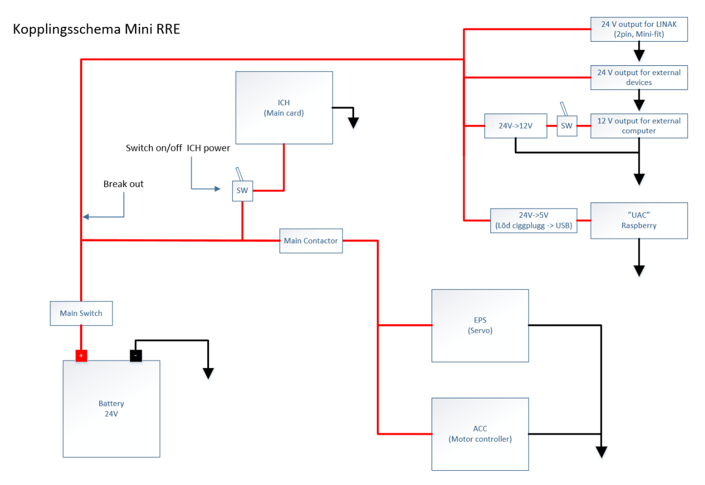
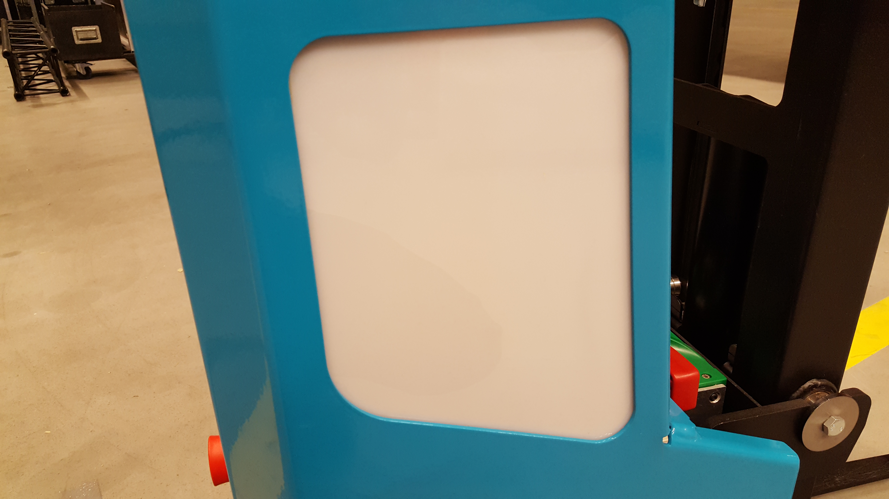

Electrical Overview
-------------------

Internally, MiniReach has a number of circuit boards,
communication buses, and other components which
handle power distribution and motion control. The system
comprises:

 * The main robot computer (Jetson TX1), running ROS, is responsible for perception
   and high level control of the robot.
   USB interfaces are used to communicate with the scanning laser range
   finder in the base of the robot and the ZED stereo 3D camera. There 
   is also a USB-DAC connected to external speakers.
   The main computer communicates with a raspberry pi using an Ethernet interface. 

\ 
 * The raspberry pi then communicates with the base using a USB socketcan interface. 

   It is also communicates with an Arduino that passes along  encoder ticks from
   an encoder connected to the drive wheel motor.

   In the current (hopefully temporaty) setup several relays connected to the 
   GPIO pins on the Arduino are used to interface with the motor controller
   from LINAK, because the company won't give us any information about their LIN based
   communication protocol. There is currently no feedback on fork and reach position 
   for this same reason.

   In the curent setup the raspberry pi runs roscore at boot, and for this reason 
   an additional relay is used to start the boot sequence on the Jetson TX1 and 
   enable the upstart launch files to find a running roscore. 

\

.. figure:: _static/communications.png
   :width: 80%
   :align: center
   :figclass: align-centered

MiniReach has a 25.9V lithium-ion battery in the base. (see
:ref:`charging`).

.. _powerdistribution:

Power Distribution
++++++++++++++++++

When a breaker is disabled or tripped, power will no longer flow to the connected
devices. In the case of MCBs (CAN nodes), this means that they will not be able to communicate
with the main computer.

.. _power_disconnect:

Power Disconnect Switch
+++++++++++++++++++++++

The power disconnect is on the right side of the battery. This switch
cuts the power between the battery all systems on the robot. 

.. figure:: _static/power_switch_arrow.png
   :width: 80%
   :align: center
   :figclass: align-centered

Emergency Stop
++++++++++++++

The runstop is used to stop all operation of the base. When the runstop is pressed, the drivers will not be able to communicate with the motor or servo controller boards, and thus their position and other data will not update in RVIZ nor the runtime monitor.

.. figure:: _static/emergency_stop.jpg
   :width: 80%
   :align: center
   :figclass: align-centered
.. _access_panel:

Access Panel
++++++++++++

NOTE: CURRENTY PRETTY EMPTY...

MiniReach has an access panel with [2 USB, an Ethernet, and an
HD Video port]. All of these ports are connected directly to the main onboard
computer (Jetson TX1). 

====== =========================
Item # Item Name                
====== =========================
 1     HD Video Port       
 2     USB Port 1
 3     USB Port 2
 4     Ethernet Port
 5     Power Button
 6     Charge Indicator Light
====== =========================
