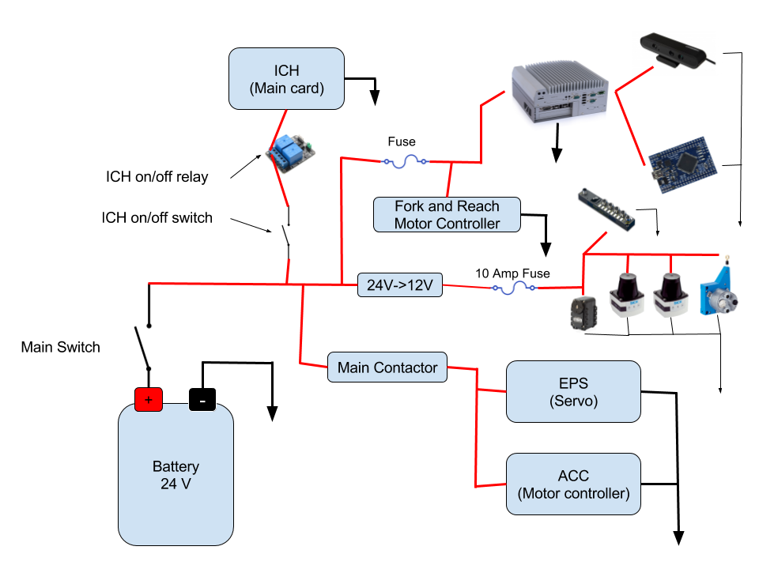
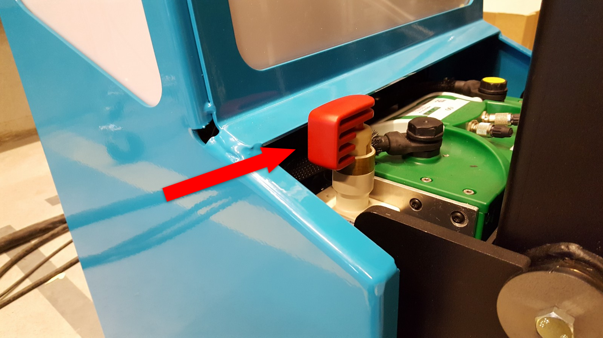
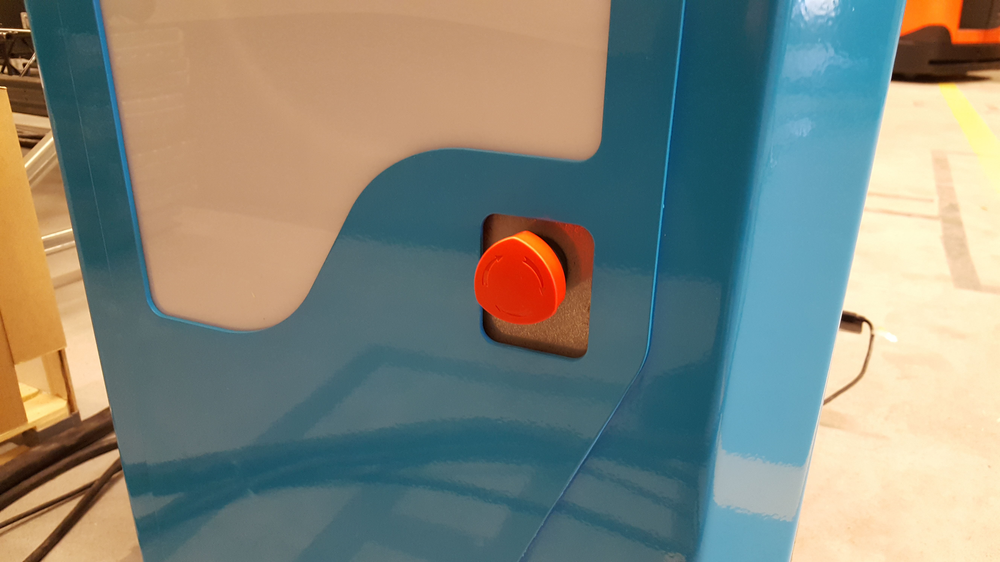

Electrical Overview
-------------------

Internally, MiniReach has a number of circuit boards,
communication buses, and other components which
handle power distribution and motion control. The system
comprises:

 * The main robot computer (Nuvo-5095GC), running ROS, is responsible for perception
   and high level control of the robot.
 * Ethernet interfaces are used to communicate with the scanning laser range
   finders in the front and back of the robot and the wire encoder for the forks (height).
 * The Orbbec Astra 3D camera is connected by USB.
 * An Arduino is connected by serial USB the computer.
   It is connected to an encoder that outputs ticks from the drive wheel rotation,
   relay modules that allow contol of fork and reach motors and a relay
   connected in series with the ICH "truck controller" power input.

.. figure:: _static/communications.png
   :width: 80%
   :align: center
   :figclass: align-centered

MiniReach has a 25.9V lithium-ion battery in the base. (see
:ref:`charging`).

.. _powerdistribution:

Power Distribution
++++++++++++++++++

.. _power_disconnect:

Power Disconnect Switch
+++++++++++++++++++++++

The power disconnect is on the right side of the battery. This switch
cuts the power between the battery all systems on the robot.

Emergency Stop
++++++++++++++

The runstop is used to stop all operation of the base. When the runstop is pressed, the drivers will not be able to communicate with the motor or servo controller boards, and thus their position and other data will not update in RVIZ.

.. _access_panel:
