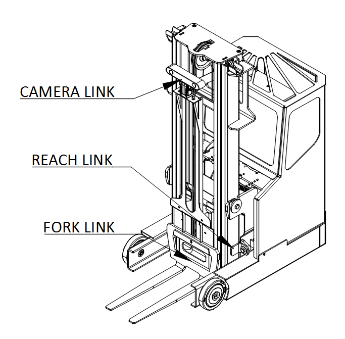

Mechanism Terminology
---------------------

The MiniReach kinematics are defined by using the concepts of
joints, links, and coordinate frames. The robot URDF (unified robot
description format) model specifies the attributes (kinematic tree,
names, ranges, etc.) of the joints, links, and frames of the robot. A
link element in the URDF describes a rigid body with inertia, visual
features, and coordinate frames. A joint element in the URDF defines
the kinematics, dynamics, safety limits, and type (revolute,
continuous fixed, prismatic, floating, or planar). Fixed joints are
typically used to describe the relationship between two rigidly joined
components in the robot.

Link
++++

The links are defined in the URDF description
that are located in the minireach_description package.

Frame
+++++

Frames represent the coordinate frames of links, detected objects,
sensors, or the location of another robot in the world. Frames are
defined relative to other frames and the transformations between each
frame is tracked using TF. See http://wiki.ros.org/tf for more
information.

Joint
+++++

A joint describes the relationship between links and are defined in the
URDF description that can be found in the minireach_description
package. The drive and steer joints are rotational, the fork
and reach joint are prismatic, and there are several fixed joints describing
the location of sensors on the truck.
Rotational and translational joints are represented
similarly in the URDF, and joint forces are described as *effort*
instead of force or torque. Position, and velocity are both used to
describe linear and angular motion of a joint.

Coordinate System
+++++++++++++++++

The coordinate frames for most links are defined
with positive z-axis up, positive x-axis in drive wheel direction and
positive y-axis to the truck-left when facing drive wheel direction.

Naming Conventions
++++++++++++++++++

In general, the names for a link, a joint, and frame will be similar
(e.g. fork_link, fork_joint, and
fork_frame). The diagrams below show
the link and joint naming conventions as well as the positive
direction of joint motion.

.. figure:: _static/minireach_joint_names.png
   :width: 100%
   :align: center
   :figclass: align-centered
