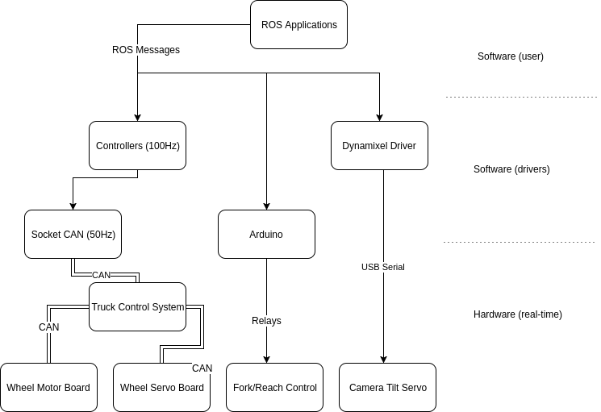

Motion Control
--------------

The drive motor and steer servo have dedicated motor controllers connected
to the CAN bus. The real-time components of the controls run on these CAN nodes.
The main computer streams commands to a third node on the CAN network refered to
here as ICH with a frequency of 50Hz using a USB socketcan interface.
The ICH board handles communication with the motor and servo controllers as well
as low-level safety, fault protection and diagnostics.

The servo has a position interface and the drive motor a velocity interface.

The servo retruns joint position information and the motor velocity information.

It should be noted that the velocity information sent by the drive motor is not of
sufficient resolution and low enough noise level for odometry calucation,
so a separate encoder (not on the CAN bus) is currently used for this.

The motor contoller interface for the fork and reach joints are currently very primitive and
can only be used to go up and down without speed control and no feedback.
