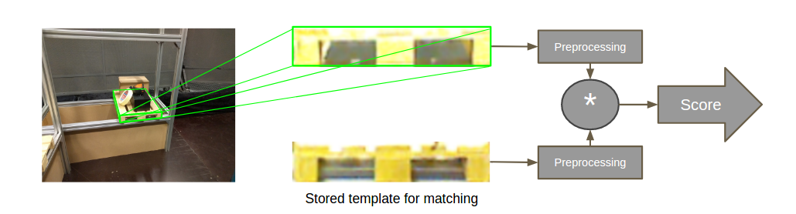

Component: Pallet tracker
======================

Overview
------------------------
The pallet tracker is using Visual Servoing platform (ViSP) 3.0.0 to track a pallet.

Documentation for the ViSP project can be found here:  https://visp.inria.fr/

Documentation for the ViSP ROS package can be found here: http://wiki.ros.org/visp_tracker

The tracking of a pallet is mainly divided into different steps

* Finding the pallet using an initial pose

  * Calulating a score for each track.
  * Choose the best track after a few iterations.

* Tracking the pallet.

Files neccesary for the tracker
------------------------

In the models folder all files neccesary for the tracker are specified::

  models/
  └── euro-pallet-aisles
      ├── euro-pallet-aisles.0.pos
      ├── euro-pallet-aisles.ac
      ├── euro-pallet-aisles.cao
      ├── euro-pallet-aisles.init
      ├── euro-pallet-aisles.ppm
      ├── euro-pallet-aisles-real.jpg
      ├── euro-pallet-aisles-sim.jpg
      └── tracker.yaml

=========================== ============================================================================
File                        Description
=========================== ============================================================================
euro-pallet-aisles.0.pos*   Holds the last pose when the tracker did an update. It is written automatically
euro-pallet-aisles.ac*      Not exactly sure what the file does. It is probably automatically generated.
euro-pallet-aisles.cao      Holds the 3D model for the object that we want to track.
euro-pallet-aisles.init     Defines 4 points in the pallets own coordinate system. These define where you should click in the camera image, to initialize the tracker. This option can be used if you don't initialize with a pose.
euro-pallet-aisles.ppm      Just an help image to help you where you should click in the image to initialize the tracker.
euro-pallet-aisles-sim.jpg 
euro-pallet-aisles-real.jpg These are the files that are used for template matching. One file for the simulator and another one for the real truck.
tracker.yaml                Parameters for the pallet tracker. Read more about how to calibrate the parameters here: http://visp-doc.inria.fr/doxygen/visp-3.0.0/tutorial-tracking-mb.html#mb_settings_xml
=========================== ============================================================================

Tracker initialization
------------------------
The initial pose is needed to get an idea of where the pallet could be. The system right now gets the information of where the pallet is by knowing the position of the rack and which storage location in the rack that the pallet should be in. For example "Pick up pallet **7** in rack **0d**".

A rack has 4 storage locations.::

  ├──────────┤
  │          │
  │  A    B  │
  ├──────────┤
  │          │
  │  C    D  │
  ├──────────┤
  │          │

The tracker starts by throwing out a cloud of trackers where the pallet might be in the storage location. The idea behind this is that at least a few trackers should converge correctly to the real pallet.

.. figure:: _static/tracking_init.png
   :width: 100%
   :align: center
   :figclass: align-centered

After 5 iterations each tracker get a score and the tracker with the highest score gets a point every iteration. After 10 iterations the tracker with most points is choosen. It gets verified for another 5 iterations. If the mean score drops below 90, the choosen tracker is too unsure and all the trackers are reinitialized. Otherwise the initialization phase was successful and the pallet should be continiously tracked.

.. figure:: _static/tracking.png
   :width: 100%
   :align: center
   :figclass: align-centered

Tracking using VISP
------------------------

For the tracking itself ViSP Markerless model-based tracking is used. See their own wiki page: http://visp-doc.inria.fr/doxygen/visp-3.0.0/tutorial-tracking-mb.html

Calculate feedback for each tracker
------------------------

Since the pallets may carry load we focus on the pallet front to get a score of how well the tracker is performing.

The 3D world coordinates of the corners of the pallet front are calculated. Then the corners are reprojected into the image using the simple relation ``y = Cx``, where ``x`` is the world coordinate, ``C`` the camera matrix and ``y`` the image coordinate. See the wikipage for more background about the camera parameters https://en.wikipedia.org/wiki/Camera_matrix.

When the corner positions in the image of the pallet are known they are mapped to the corners in a [20x108] pixels image.

Ranking using template matching
------------------------

First a template has been loaded. To minimize the effect of always giving a high score to whiteness in the image the mean is first subtracted from the template image.

Some improvements can be used to make it even more invariant to illuminance change.

* Normalize both images before template matching.
* Convert image to HSV colorspace and use the hue channel.

This rectified image is now directly pixelwise multiplied with the preprocessed image. All the values in the remaining image (matrix) are summed up and this is the score for that tracker.

The score is transformed to a score between 0 and 100 by using a sigmoid function: sigmoid = 100 / (1 + exp(-(score - a) + b)). a and b are tuning parameters.

Linköping University has some good resources to read about template matching (starting from p.9): http://www.isy.liu.se/cvl/edu/TSBB08/lectures/DBgrkMatchedFilters.pdf

.. NOTE::
  The template matching used in this example is template matching without correlation, i.e. template matching without a sliding window since it is known that the template and rectified image should align up perfectly.

Ranking using AdaBoost instead
------------------------

The ranking can be much more robustly done using by adaBoost instead of using template matching. It is not integrated at the moment because when we tried to integrate it, unstable behaviour showed up and the system crashed non-deterministically.

If the source for this behaviour is found, the AdaBoost classifier can be integrated very easily. To integrate it only three lines of code are neccesary.::

  #include "adaboost.h"
  // #include <minireach_vision/adaboost.h> or if you install adaboost.h in install and add it to the CMakeList.txt

Add loadClassifier where you want to load it, presumably in the constructor::

  ada.loadClassifier(classifier_path);

Classify an image, not that it has to be a 3 channel image of size [108x20] pixels for the already trained classifiers::

  ada.classify(img)

A few classifier should be avaliable in the folder *minireach_vision/share/classifiers*.

The flowchart still looks almost exactly the same as before.

.. figure:: _static/adaboost_flow_chart.png
   :width: 100%
   :align: center
   :figclass: align-centered

Change model or create your own model
------------------------

If you want to create your own model, you will have to create a new cao file. It is possible to create the model using a CAD application, but for simpler models it might be faster to just draw you model on a paper and enumerate all the corners. Specify each corner's location in 3D space and specify the lines and/or faces of your object, by specifying the indices of the corners that define the line or face.

A file might look like this::

  V1
  # Number of points
  8
  # 3D points (x, y, z)
  -1.0 -1.0 -1.0,
  -1.0 -1.0  1.0,
  -1.0  1.0 -1.0,
  -1.0  1.0  1.0,
   1.0 -1.0 -1.0,
   1.0 -1.0  1.0,
   1.0  1.0 -1.0,
   1.0  1.0  1.0,
  # 3D lines
  0
  # Faces from 3D lines
  0
  # Faces from 3D points, first number is the number of points
  # The rest are the indices
  6
  4 0 4 6 2
  4 0 2 1 3
  4 0 1 5 4
  4 4 5 7 6
  4 2 6 7 3
  4 1 3 7 5
  # 3D cylinders
  0
  # 3D circles
  0

Here you can read more about creating your own models: http://visp-doc.inria.fr/doxygen/visp-daily/tutorial-tracking-mb.html#mb_advanced_cao
  
Known problems and suggested solutions
------------------------

* Fix bug so it is possible to pick up from left hand side from a rack. At the moment something crashes when you try to send a mission to pick up from rack position a or c.

Future Work
------------------------
* Add pallet from GUI should be possible
* Change pallet position automatically after the truck has moved it in the real world.
* Adding/enable more features on the PS-controll, such as reach the forks up/down and in/out.
* More robustness

  * Add AdaBoost classifier.
  * The tracker should automatically stop it the confidence of the track drops below a threshold.
  * The parameters in track.xml should be fine tuned.

* Nice GUI for ordering page.
* It should be possible to train the AdaBoost classifier in a simple way.
  
Suggestion for extensions
------------------------

