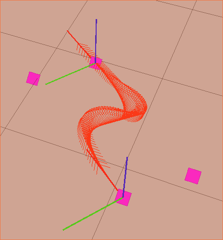
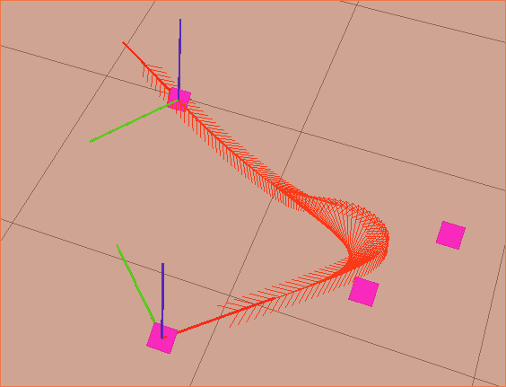

Component: Precision control
======================

Overview
------------------------
This page explains how the route planning and route following (precision control) works when the truck is driving in fork forward direction.

The move_precise function can be divided into the following parts:

* The route is generated using a bezier curve.
* The route is followed using a PID controller which controls the angular velocity.
* While the linear velocity of the truck is controlled with feedback and feedforward.

For a more detailed analysis of the problem see the technical report from 2017 CDIO project :  https://link to webpage

Problem description
------------------------

If the forklift truck receives a mission it first uses a "long planner" in order to move the truck quickly to an approximate position in front of the pallet ordered for pick up
Thereafter with a objective known we need to position the truck with precision in front of the holes, which is our problem in this case.
The problem is further complicated by the fact that the truck has to drive in fork forward direction since the truck then tend to draw away from its track and  end up with wrong angle.

With the current pallet tracking implementation it is important that the angular velocity is not too high since the images might end up with low resolution, thus loosing track of the pallet.
However one wish from toyota is for the truck to be able to execute 90 degree or even u-turns in tight storages.
With tight storages it is meant storages where the truck lack space to stand straight in front of the pallet before starting the precision control.
A solution for this case requires a new method for pallet tracking. However from a control perspective a solution has been developed for the simulation case.

A robust controller that can handle all types of curves was developed during the cdio2017 however this controller has currently only been trimmed for the simulator and currently doesn't work.

File location
------------------------
All source code for both route planning and following can be found in:
minireach_apps/minireach_tasks/handle_pallets/move_precise.py

Github branches
------------------------

In the models folder all files necessary for the tracker are specified::

  minireach_apps
      ├── Indigo Roccon   (Best controller for real truck, contains bezier planner and pd-controller for angular velocity, linear velocity is constant)
      ├── reglering2017   (Same as Indigo roccon but with a linear velocity control as well as a PID instead of PD for angular_vel)
      ├── cdio-2017       (Best controller for simulation, Same as reglering2017 but with a modified route planning, where the truck sends a target 15 cm in front of goalpose and corrects the angular error before continuing)
      ├── reglering2017ff (Same as reglering2017 but where a feedforward for the angular velocity has been implemented, it currently needs some more modifications to work)

Configuration
------------------------

=========================== ============================================================================
Parameter                    Description
=========================== ============================================================================
filter_error_T              Constant for low-pass filtering of angular error
filter_derivative_T         Constant for low-pass filtering of derivative of angular error
shape_start                 Determines the shape of the start of the planned curve
shape_target                Determines the shape of the end of the planned curve
linear_error_until_half_cor Determines how big the linear error can be until the correction degree is half of maximum
max_linear_correction_deg   Determines the maximum correction degree in order to decrease linear error where 90 degrees is orthogonal to the path
proportional_c              Proportional part of the PID for angular velocity control
derivative_c                Derivative part of the PID for angular velocity control
integrative_c               Integrative part of the PID for angular velocity control
linear_speed_constraint_c   Linear feedback parameter that punishes the speed if the error in last samples has been big
linear_future_speed_const   Linear feedforward parameter that punishes the speed if the truck has to turn in the future
max_linear_speed            Maximum linear movement speed for the truck
max_angular_speed           Maximum angular movement speed for the truck
max_allowed_angle_error_deg Biggest allowed angular error
=========================== ============================================================================

.. figure:: _static/controlconfig.png
   :width: 100%
   :align: center
   :figclass: align-centered

Route planning
------------------------
The route to the goal position is as mentioned above done using a cubic bezier curve. The reason for this choice is that it is simple and ccan prevent the camera to lose track of the pallet unless the curve is too sharp.
The cubic bezier curve works in a way that it puts out 4 points(including the start point) and from these it makes a curve.
The sharpness of this curve can be regulated by the parameters shape_start and shape_target. In the images below you can find some example curves generated.

.. figure:: _static/easyScurve.png
   :width: 100%
   :align: center
   :figclass: align-centered

Angular controller
------------------------
In order for the forklift truck to follow the generated route a pid controller is used, it is implemented in the following way.

* Find the closest point on the line
* Using the derivative of the Bezier curve find the desired direction in that point
* Calculate the desired angle to reach the curve in order to minimize the error between truck and the point
  This is done arbitrarily with an arctan-function that results in a flow field pointing along the curve at short distances to curve as well as towards the curve for bigger distances, the angle between truck and curve is maximum max_linear_correction_deg.
* Determine the error between desired and actual angle of the truck and filter it with a lowpass-filter
* The control signal is derived from the determined error using standard PID controller
* set the desired angular velocity as the control signal

Currently the integrative part of the PID controller is implemented but not used since it handles static error and it is a bit difficult to exactly see the static error with the current error implementation.
There are also parameters that determine maximum angular velocity this is something that want to be reduced as much as possible and instead adjust using the PID controller.

Linear velocity controller
------------------------
The linear velocity controller is own designed with a feedback and a feedforward part

Feedback part:
The feedback part is aimed to slow the truck down if the error in the last sample has been big thus implying that the track currently is difficult
For n=1,2,...N
Feedback=linear_speed_constraint_c*Sum(abs(e(n)))/N
Currently N is put as 10 however it has been noted that the samples have different meanings in simulation than reality thus it might be neccesary to increase N significantly.

Feedforward part:
The feedforward is aimed at slowing down the truck if the curve in the close future is taking a bigger turn thus implying it can be more difficult to follow.
For m=5,10,15   where m=5 is 5 samples into the future etc. This can be changed in the code.
L1 is the current direction vector of the track and is calculated by the current closest point on curve and the following points.
Meanwhile L2 is the direction vector between the current point on the curve and point m forward.
Feedforward=future_speed_constraint_c*sum(arccos(L1*L2(m)/(abs(L1)*abs(L2(m)))))/length(m)

linear_speed=max_linear_speed-Feedback-Feedforward
max_linear_speed is a parameter that limits the maximum speed of the truck it is however wished that the truck goes as fast as possible and thus that htis parameter is as big as possible.

Planning changes
------------------------
.. NOTE:: these changes only exist in cdio-2017 repo. Also it currently only works in simulation

In order to make the precision control more robust and to fulfill all types of curves the planner has been slightly modified.
Instead of going directly to goalpose the truck aims for a point 15 cm straight in front of the pallet with a control focus on correct position.
Once the point has been reached it turns itself up and thus decreases the angular error. Finally the truck sets up 3 different target positions each 5 cm straight forward.
At the last of these points the truck only focuses the control of the angle(in order to get the angle right).
This method seem very feasible by results in simulation since it is robust for different kind of curves and reach the goal with very high precision.

Further implementations
------------------------
In the reglering2017ff repo a feedforward controller of the angular velocity has been implemented it is currently not finished and will thus need some time to work.
In order for the truck to manage to take really sharp curves the earlier implementation requires an aggressive controller.
However a too aggressive controller produces a oscillative behaviour in the truck, clearly seen after the implementation of the offset dynamic in control wheel and put extra stress on stearing actuators. This is undesired even if the truck fulfills the precision demands.
A feedforward makes it possible to decrease the dependency of the feedback and is possible since we know the curve we want to follow.
Thus a reasonable alternative to an aggressive controller is a feedforward. The feedforward can be implemented in many ways.
In reglering2017ff it was used the fact that the curve is known thus calculating the second derivative of the curve and from this determine with respect to the time offset what the angular velocity should be.
Other ways of doing this is mentioned in future work below.

Future work
------------------------
Much of what was done during the cdio project 2017 was only done in simulator. The difference between simulator and reality is big therefore it is important that someone trims the newly developed controller to work also in reality.
Three possible causes for the big error in reality vs simulation is signal error, model error and software limits decreasing simulation speeds compared to real life.
One of these software limits on the angular velocity was found in Gazebo and removed making the truck movements much more coherent with the real truck.
The controller still managed to work with this removal however it was really slow depending on the velocity control that limits speed if error is big. In the real truck the speed was really big indicating that the velocity control needs to be trimmed for the real case.
This gives hope to achieving a controller that works more like the robust one seen in cdio2017.

The feedforward in reglering2017ff needs to be finished in order to evaluate the results, but in theory the feedforward seems like a very viable solution.
In the feedforward one could also integrate the model for how the truck will move. One such dynamic state space model was made during the 2017 cdio project.
If this is not enough one could also turn this in to a optimization problem by implementing the developed dynamic model in a model predictive controller and from this achieve the optimal angular velocity, thus replacing the pid. But we highly recommend finishing the feedforvard implementation first for simplicity's sake 
