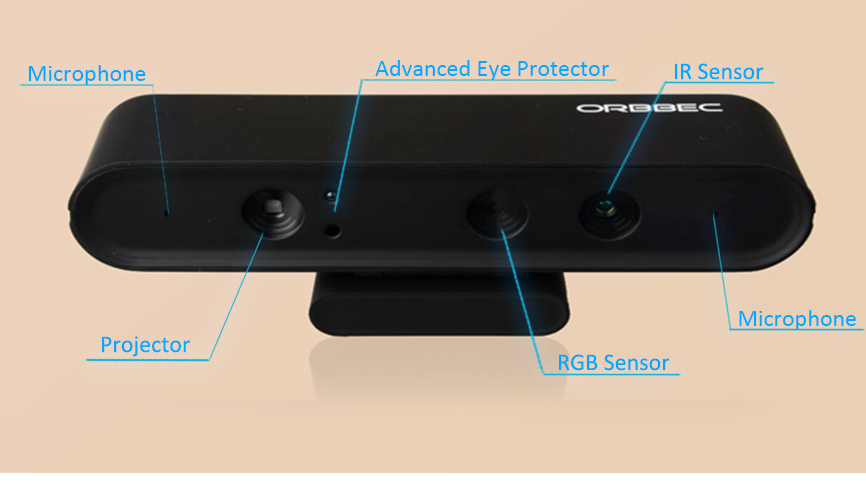

Sensor Overview
---------------

Laser Scanners
++++++++++

The truck has two Sick TiM 561 laser scanners. One mounted in front of the 
drive wheel and the other on a support leg by the forks. The
lasers have a range of 10m, 270° field of view, 15Hz update rate
and angular resolution of 0.33°. They publish distances
to the **scan1** and **scan2** topics in ROS.

.. figure:: _static/sick561.png
   :width: 50%
   :align: center
   :figclass: align-centered

3D Camera
+++++++++++

The truck has an Orbbec Astra 3D camera in the fork direction. This
depth camera works best in the 0.4-8m range. See :ref:`camera_api`
for details on the ROS API.

