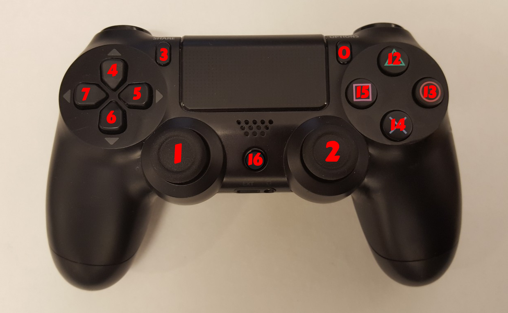

Tutorial: Robot Teleop
======================

Using the Robot Joystick
------------------------
.. embed-pt

Whenever the robot drivers are running, so is joystick teleop.
The joystick is capable of controlling the movement of the robot
base. (fork, reach and 3D camera control is currenty disabled because
they are position controlled).

.. figure:: _static/joystick_numbered2.png
   :width: 100%
   :align: center
   :figclass: align-centered

======== =================================
Button # Function (details below)
======== =================================
 0       Not used
 1       Control robot movement
 2       Control fork up/down (disabled)
 3       Not used
 4       Not used
 5       Not used
 6       Not used
 7       Not used
 8       Control reach in (disabled)
 9       Control reach out (disabled)
 10      Primary deadman
 11      Disable safety (not implemented)
 12      Not used
 13      Force log in to truck
 14      Not used
 15      Not used
 16      Pair/unpair with robot
======== =================================

To pair the controller with the robot, press the middle button (16) once
the robot has powered on. The big LED on the controller will turn a solid
blue when successful.
To unpair, hold the button for 10 s. The blue LED indicator on the back will turn off.

To drive the robot base, hold the primary deadman button (button 10
above) and use the left joystick.

.. warning::

    Whenever driving the robot, always lower the fork to avoid damaging objects and people

To control the 3D camera, release the secondary
deadman (button 11). The right joystick now controls camera tilt.

Moving the Base with your Keyboard
----------------------------------

.. note::

   You will need a computer with ROS installed to properly
   communicate with the robot. Please consult the `ROS Wiki <http://wiki.ros.org/indigo/Installation>`_
   for more information. We strongly suggest an Ubuntu machine
   with ROS Indigo installed.

To teleoperate the robot base in simulation, we recommend
using the ``teleop_twist_keyboard.py`` script from
`teleop_twist_keyboard <http://wiki.ros.org/teleop_twist_keyboard>`_
package.

::

  >$ export ROS_MASTER_URI=http://<robot_name_or_ip>:11311
  >$ export ROS_HOSTNAME=<robot_name_or_ip>:11311
  >$ rosrun teleop_twist_keyboard teleop_twist_keyboard.py
