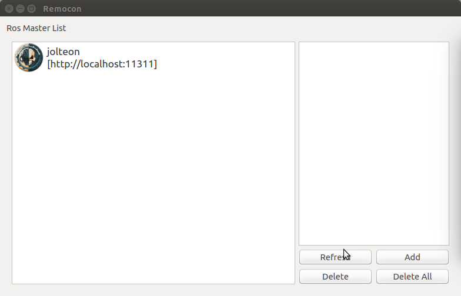

Troubleshooting
===============

.. _troubleshooting:

Troubleshooting Simulated Truck
-------------------------------
The best tips for almost every troubles one might get over is to restart terminals, computer or even truck. It is also a good advise to have patient and be cool.

Connection failed
^^^^^^^^^^^^^^^^^

While trying to connect to the simulated truck in Gazebo one might get the following error.

The solution is to either refresh the connection by clicking the button like in the picture below, or simply restart the terminalwindow one is using to start the simulation. Unfortunaly the reason behind this error is unknown, at writing moment, it does occur when trying to connect before the roscore is ready, patient is your best friend.

Troubleshooting Real Truck
-----------------------------

TODO: write this...
