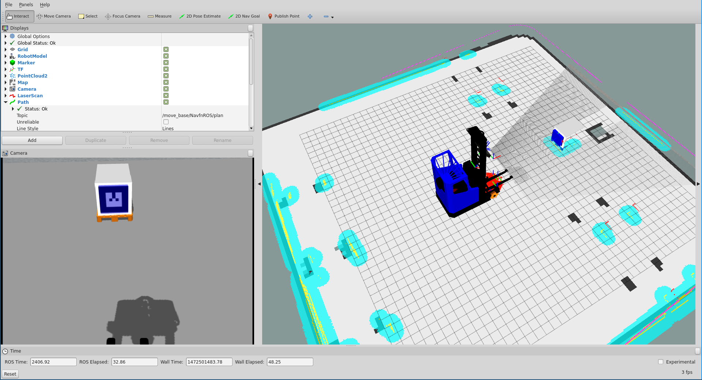

Tutorial: Visualization
=======================

.. _rviz:

Visualizing with RVIZ
---------------------

.. embed-rviz-start

::

    >$ export ROS_MASTER_URI=http://<robot_name_or_ip>:11311
    >$ rosrun rviz rviz

.. figure:: _static/rviz.png
   :width: 100%
   :align: center
   :figclass: align-centered

.. note::

   You will need a computer with ROS installed to properly
   communicate with the robot. Please consult the `ROS Wiki <http://wiki.ros.org/indigo/Installation>`_
   for more information. We strongly suggest an Ubuntu machine
   with ROS Indigo installed.

You can now `manually set up your RVIZ visualization
<http://gazebosim.org/tutorials?tut=drcsim_visualization&cat=drcsim#VisualizingtheRobotmodel>`_
or re-run RVIZ with a configuration file using the command line.
The default ``.rviz`` configuration file for MiniReach can be loaded using:

::

    >$ export ROS_MASTER_URI=http://<robot_name_or_ip>:11311
    >$ roslaunch minireach_rviz navigation.launch 

.. embed-rviz-end
.. embed-runtime-monitor-start

Using the Runtime Monitor
-------------------------
NOTE: NOT YET IMPLEMENTED

MiniReach publishes ROS diagnostics messages. These are human-readable
messages that inform users of the robot system state. The `runtime_monitor`,
part of ``rqt_robot_plugins`` can be used to view diagnostics from your
desktop computer:

::

    >$ export ROS_MASTER_URI=http://<robot_name_or_ip>:11311
    >$ rosrun rqt_runtime_monitor rqt_runtime_monitor

If no information is recieved from nodes or devices before a given timeout, they go stale in the diagnostics interface.

.. embed-runtime-monitor-end
